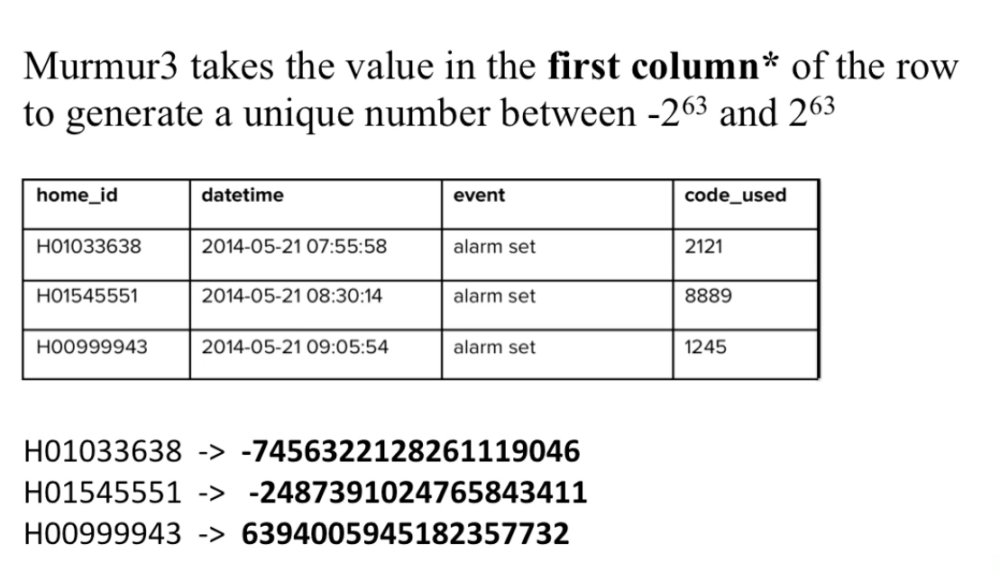
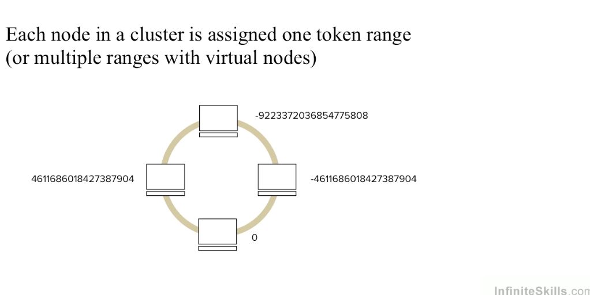
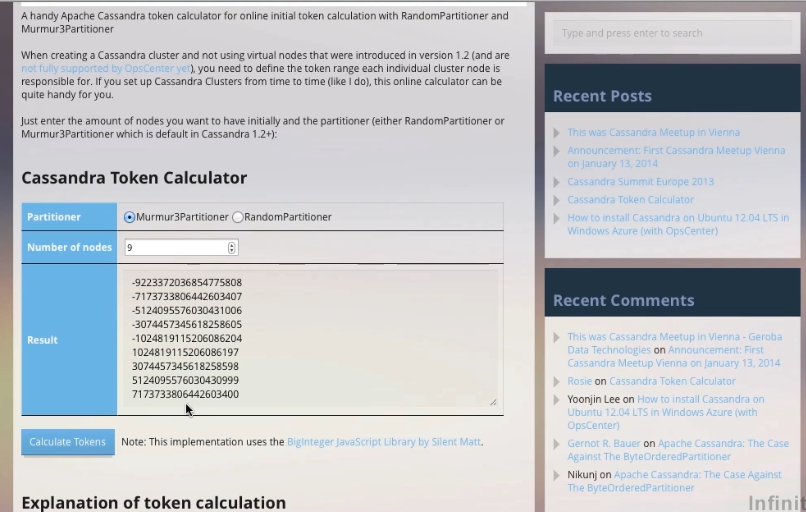
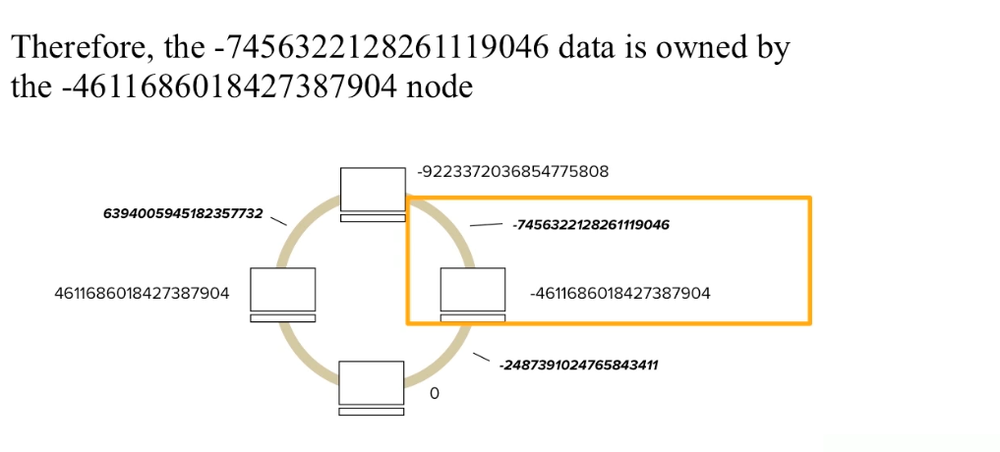
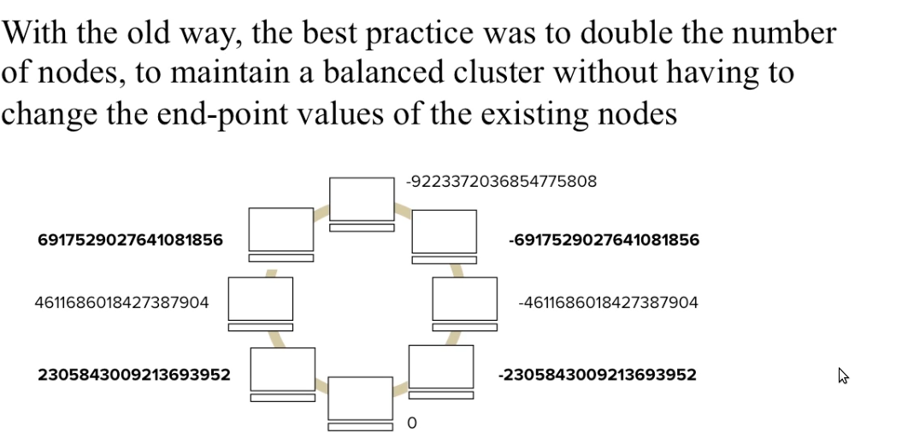
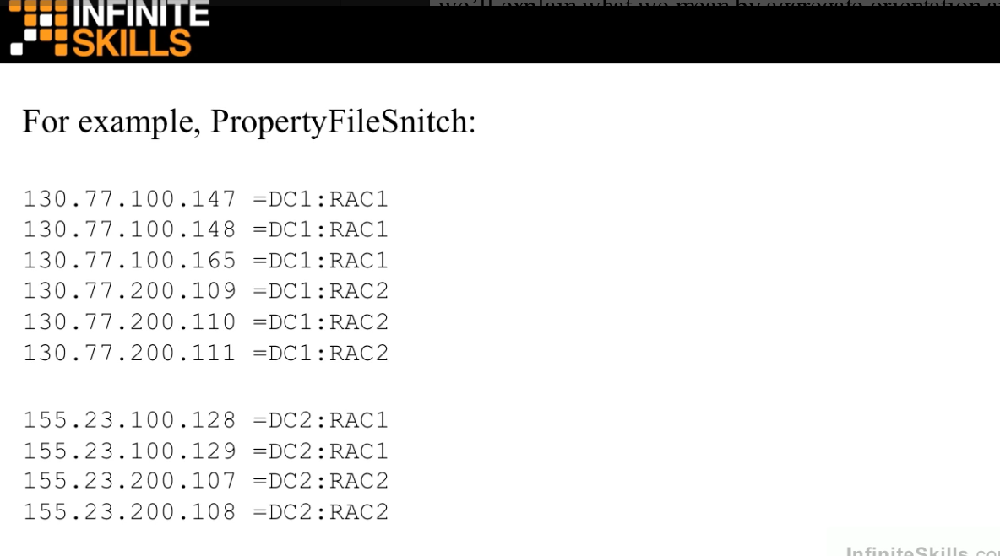

# Cassandra
## Why use Cassandra ?
- Is a good fit for several nodes, a great fit if your application is expected to require `dozen of nodes`.
- Lots of writes, statistics, analysis. Consider your application from the perspective of the ratio of reads to write. `Excellent throughput on writes`.
- Has out of the box support for `geographical distribution` of data. Easily to replicate data across multiple data centers.

## Cassandra key features
- **Linear scalability**: You can add more and more nodes to the cluster and it will still have the top performance
- **Fault tolerance**: You don't have to worry about a master node going down and the whole things stop to work
- **Commodity hardware**: You do not have to buy specialized servers in order to run cassandra you can use commodity hardware
- **Highly-performant**: For realtime application, different with hadoop when they run at nights, at batches. Those traditional databases are not designed for realtime

## Database distribution
 To distribute the trows across the nodes, a partitioner is used. The partitioner uses an algorithm to determin which node a given row of data will go to

 
 
 
 
 
 
 

### Virtual nodes
 Instead of a node being responsible for just one token range, it is instead responsible for many small token ranges(by default, 256 of them)
 
 - Virtual nodes were created to make it easier to add new nodes to a cluster while keeping the cluster balanced
 - When a new ndoe is added, it receives many small token range slices from the existing nodes, to maintain a balanced cluster

 
## Usecases
- Sensor data
- Recommendation engine, gaming, fraud detection, location based services

## Data modeling [1]
### Query-first design
In cassandra you don't start with the data model, you start with the query model

## Cassandra configuration
### Snitch
Snitch is how the nodes in a cluster know aout the topology of the cluster

## Read/ Write data [2]

### Gossip
Every one second, each node communicates with up to theree other nodes, exchanging information about ifself and all the other nodes that it has information about

- Gossip is the **internal** communication method for nodes in a cluster to talk to each other
- For **external communication** such as an application to a database, CQL or Thrift are used

## Reference
[1] Cassandra: The Definitive Guide (https://learning.oreilly.com/library/view/cassandra-the-definitive/9781098115159/)

[2] https://www.udemy.com/course/apache-cassandra/
https://www.javatpoint.com/use-cases-of-cassandra