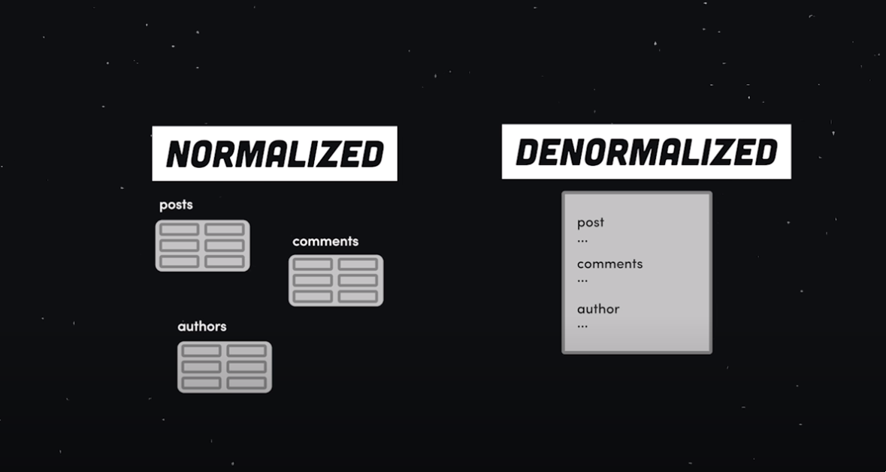
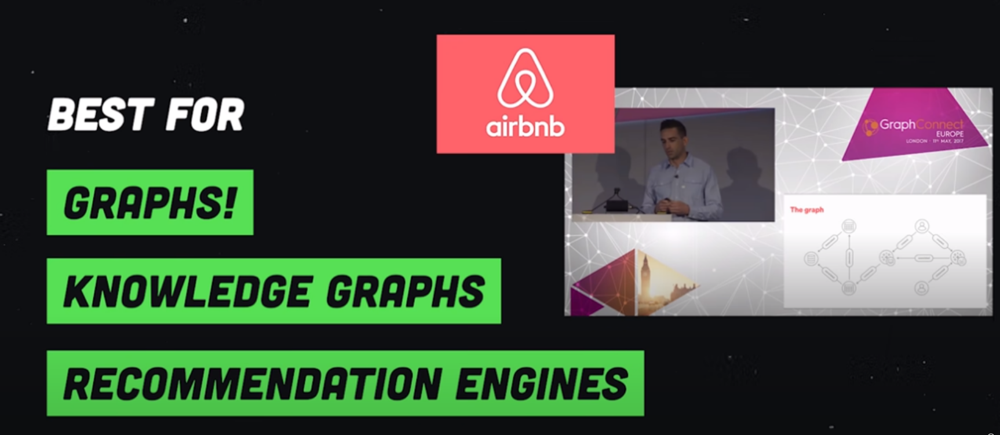

# Choosing database

[7 Database Paradigms - YouTube](https://www.youtube.com/watch?v=W2Z7fbCLSTw)

## Columned based
- `Decentralized and can scale horizontally`, a popular usecases for scaling  a large amount of time-series data like records from an IOT device, weather sensor, on in the case of netflix, a history of different shows watch you watched
- It's often used in situation where you have `frequent write` but `infrequent update and reads`
- When you need to retrieve columns of data in one disk block to reduce disk I/O.
- It's not going to be your primary app database. For that you need something more general purpose

## Document oriented database
Tradeoff: Schemaless relation-ish queries without joins

Reads from a frontend application are much faster however writing or updating data tend to be more complex, document  databases are far more general purpose than the other options

For developers, they are easier to use, best for mosts apps, games, iot and many other usecases. If you are not sure how  your data is structured at this point, a document database is properly

## Graph database

## Chosing your database
Two reasons to consider a NoSQL database: programmer productivity and data access performance.
- To improve programmer productivity by using a database that better matches an application’s
needs.
- To improve data access performance via some combination of handling larger data volumes,
reducing latency, and improving throughput.

It's essential to test your expectation about programmer productivity and performance before commiting to using a NoSQL technology

### Sticking with the default
There are many cases you’re better off sticking with the default option of a relational database:
- You can easily find people with the experience of using them.
- They are mature, so you are less likely to run into the rough edges of new technology
- Picking a new technology will always introduce a risk of problems should things run into difficulties

---
### SQL
traditional SQL databases are missing two important capabilities — linear write scalability (i.e. automatic sharding across multiple nodes) and automatic/zero-data loss failover.

This means data volumes ingested cannot exceed the max write throughput of a single node.

Additionally, some temporary data loss should be expected on failover

. Zero downtime upgrades are also very difficult to achieve in the SQL database world.

### NoSQL
NoSQL DBs are usually distributed in nature where data gets partitioned or sharded across multiple nodes. 
They mandate denormalization which means inserted data also needs to be copied multiple times to serve the specific queries you have in mind. 