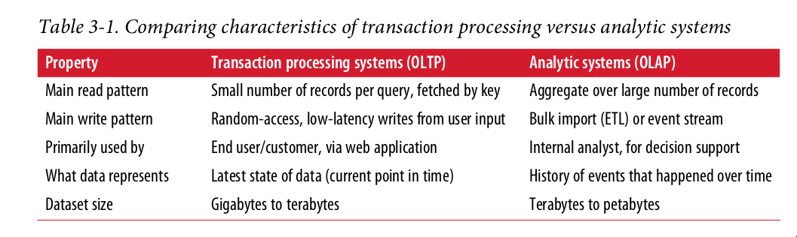

## 1. Foundation of data systems [1]

### 1.1. Reliability
- `Tolerate` hardware and software & software faults
- The system should continue to work correctly even in the face of adversity.

#### 1.1.1. Hardware faults
Anyone who has worked with large datacenters can tell you that these things happen all the time when you have a lot of machines: 
- Hard disk crash
- RAM becomes faulty
- The power grid has a blackout
- Someone unplugs the wrong network cable.

We can achieve `reliability` by using software fault-tolerance techniques in preference or in addition to hardware
redundancy.

For example: A single-server system
requires planned `downtime` if you need to reboot the machine. Whereas a system that can tolerate machine failure can be patched one node at a time, without downtime of the entire system.

#### 1.1.2. Software errors
- Hardware faults as being random and independent from each other. It is unlikely that a large number of hardware components will fail at the same time.
- A software bug that causes every instance of an application server to crash when
given a particular bad input
- A service that the system depends on that slows down, becomes unresponsive, or
starts returning corrupted response
- Cascading failures, where a small fault in one component triggers a fault in
another component, which in turn triggers further faults

Solutions:
- Carefully thinking about assumptions and interactions in the
system
- Thorough testing
- Process isolation
- Allowing processes to crash and restart
- Measuring, monitoring, and analyzing system behavior in production

#### 1.1.3. Human errors
Configuration errors by operators were the leading cause of outages, whereas hard‐
ware faults (servers or network) played a role in only 10–25% of outages

How we make our system reliables:
- Test thoroughly at all levels, from unit tests to whole-system integration tests and
manual tests
- Make it fast to roll back configuration changes, roll
out new code gradually
- Set up detailed and clear monitoring, such as performance metrics and error
rates

#### 1.1.4. How important is reliability?
- Bugs in business applications cause `lost productivity`
- Outages of ecommerce sites can have huge costs in terms of `lost revenue
and damage to reputation`.

### 1.2. Scalability
- Measuring  load & performance
- Latency percentiles, throughput
- As the system grows, there should be reasonable ways of dealing with that growth. Scalability is the term we use to describe a system’s ability to cope with increased
load.

#### 1.2.1. Describing Load
- Post tweet: A user can publish a new message to their followers (4.6k requests/sec on aver‐
age, over 12k requests/sec at peak)

- Home timeline: A user can view tweets posted by the people they follow (300k requests/sec)

 

#### 1.2.2. Describing performance
If the 95th percentile response time
is 1.5 seconds, that means 95 out of 100 requests take less than 1.5 seconds

### 1.3. Maintainability
- Operability
- Simplicty & evolvability

#### 1.3.1. Operability
Make it easy for operations teams to keep the system running smoothly.

#### 1.3.2. Simplicity
Make it easy for new engineers to understand the system, by removing as much
complexity as possible from the system. (Note this is not the same as simplicity
of the user interface.)

#### 1.3.3. Evolvability
Make it easy for engineers to make changes to the system in the future, adapting
it for unanticipated use cases as requirements change. Also known as extensibility, modifiability, or plasticity.

## 2. Data model and query languages
### 2.1. The Birth of NoSQL
- A need for greater scalability than relational databases can easily achive, including very large datasets or very high write throughput
- Specialized query operations that are not well supported by the relational model
- Frustration with the restrictiveness of relational schemas, and a desire for a more
dynamic and expressive data model

### 2.2. Document data model and JSON
The JSON representation has better `locality` than the multi-table schema. If you want to fetch a profile in the relational example, you need to either
perform multiple queries or perform a messy multi-way join between the users table and its subordinate tables. In the JSON representation, all the relevant information is in one place, and one query is sufficient.

- If the data in your application has a document-like structure (i.e., a tree of one-to-many relationships, where typically the entire tree is loaded at once), then it’s probably a good idea to use a document model.

#### 2.2.1. Advantage
- Flexibility in the document model: Do not enforce any schema on the data in documents
- Data locality for queries: If your application often
needs to access the entire document (for example, to render it on a web page), there is
a performance advantage to this storage locality
But it is generally recommended that you keep
documents fairly small and avoid writes that increase the size of a document

#### 2.2.2. Limitation
- you cannot refer directly to a nested item within a document, but instead you need to say something like “the second item in the list of positions for user 251”
- Poor support for join.
- Many-to-many relationships may never be needed in an analytics application that uses a document database to record which events occurred at which time

### 2.3. Schema changes

Schema changes have a bad reputation of being slow and requiring downtime.

MySQL is a notable exception—it
copies the entire table on `ALTER TABLE` , which can mean minutes or even hours of
downtime when altering a large table although various tools exist to work around
this limitation

#### MapReduce Querying
MapReduce is a programming model for processing large amounts of data in bulk
across many machines, popularized by Google

### 2.4. Graph-Like Data Models
- If your application has mostly one-to-many relationships (tree-structured data) or no relationships between records, the document
model is appropriate.

- If many-to-many relationships are very common in your data? The relational model can handle simple cases of many-to-many relationships, but as the con‐
nections within your data become more complex, it becomes more natural to start
modeling your data as a graph

A graph consists of two kinds of object: Vertices and edges. Many kinds of data can be modeled as a graph. Typical examples include: 

- Social graphs: Vertices are people, and edges indicate which people know each other.
- The web graph: Vertices are web pages, and edges indicate HTML links to other pages.
Well-known algorithms can operate on these graphs:
- Car navigation system:  search for the shortest path between two points in a road network
- PageRank can be used on the web graph to determine the popularity of a web page
and thus its ranking in search results.

## 3. Storage and Retrieval
- Why should you, as an application developer, care how the database handles storage and retrieval internally. You do need to select a storage engine that is appropriate for your application, from the many that are available.
- In order to tune a storage engine to perform well on your kind of workload, you need to have a rough idea of what the storage engine is doing under the hood.
- There is a big difference between storage engines that are optimized for transactional workloads and those that are optimized for analytics.

Two families of storage engines:
- Log-structured storage engines
- Page oriented storage engines such as B-Trees. 

### 3.1. Hash index
- Is usually implemented as a hash map.
- Let’s say our data storage consists only of appending to a file, Whenever you append a
new key-value pair to the file, you also update the hash map to reflect the offset of the
data you just wrote
- When you want to look up a value, use the hash map to find the offset in the data file, seek to that location, and read the value.

How we avoid eventually running out of disk space?
  - break the log into segments of a certain size by closing a segment file when it reaches a certain size
  - making subsequent writes to a new segment file
  - We can then perform compaction on these segments. Compaction means throwing away duplicate
keys in the log, and keeping only the most recent update for each key.

  - merge several segments together at the same time as performing the compaction

Hash index implementation, append-only log: The order of key-value pairs in the file does not matter
- File format: It’s faster and simpler to use a binary format
- Deleting records: If you want to delete a key and its associated value, you have to append a special deletion record to the data file (sometimes called a tombstone)
- Crash recovery: If the database is restarted, the in-memory hash maps are lost.
storing a snapshot of each segment’s hash map on disk, which can be loaded into memory more quickly.
- Partially written records: The database may crash at any time, including halfway through appending a record to the log. Bitcask files include checksums, allowing such corrupted parts
of the log to be detected and ignored.
- Concurrency control: As writes are appended to the log in a strictly sequential order, a common implementation choice is to have only one writer thread

#### append-only design turns out to be good for several reasons
- Appending and segment merging are sequential write operations, which are gererally much faster than random writes
- Concurrency and crash recovery are much simpler if segment files are append only or immutable.
#### Limitation
- The hash table must fit in memory, so if you have a very large number of keys, you’re out of luck.

### SSTables(Sorted String Table) and LSMTrees
- The sequence of key-value pairs is sorted by key.
Advantages over log segments with hash indexes:
- Merging segments is simple and efficient even if the files are bigger than the
available memory

- In order to find a particular key in the file, you no longer need to keep an index
of all the keys in memory. You still need an in-memory index to tell you the offsets for some of the keys, but it can be sparse: one key for every few kilobytes of segment file is sufficient
 

#### Constructing and maintaining SSTables
- How do you get your data to be sorted by key in the first place? Our
incoming writes can occur in any order.? We can insert keys in order and read them back in sorted order with Red-black trees, AVL trees
Working flow:
- When a write comes in -> add it to an in-memory balanced tree data structure(red-black) tree. This is sometimes called a memtable.
- When the memtable gets bigger than some threshold -> write it out to disk as an SSTable file
- The new SSTable file becomes the most recent segment of the database.
- In order to serve a read request, first try to find the key in the memtable, then in the most recent on-disk segment, then in the next-older segment,
- From time to time, run a merging and compaction process in the background to combine segment files and to discard overwritten or deleted values.

#### Making an LSM-tree out of SSTables

### B-Trees
B-Trees keep key-value pairs sorted by key, which allows efficient value lookups and range queries. 

Log structured indexes break the database down into variable-size segments typically several megabytes or more in size, and always write a segment sequentially

B-trees break the databaes down into fixed-size blocks or pages, traditionally 4KB in size(sometimes bigger) and read or write one page at a
time. This design corresponds more closely to the underlying hardware, as disks are
also arranged in fixed-size blocks.

### Decding factor between B-tree and LSM trees
https://rkenmi.com/posts/b-trees-vs-lsm-trees#:~:text=Modern%20databases%20are%20typically%20represented,in%20fixed%20size%20page%20segments.
- B-Trees typically modify entries in-place
- LSM trees on the other hand append entries and discard stale entries from time to time
- B-Trees only have to worry about 1 unique key
- LSM trees will potentially have duplicate keys

If `reads` are a concern, then it may be worthwhile to look into B-Trees instead of LSM Trees. In a nutshell, if we do a simple database query with LSM Trees, we'll first look at the memtable for the key. If it doesn't exist there, then we look at the most recent SSTable, and if not there, then we look at the 2nd most recent SSTable, and onwards. This means that if the key to be queried doesn't exist at all, then LSM Trees can be quite slow.

Otherwise if writes are a concern, LSM Trees are more attractive due to sequential writes. In general, sequential write is a lot faster than random writes, especially on magnetic hard disks. Do note though, that the maximum write throughput can be more unpredictable than B-Trees due to the periodic compaction and merging going on in the background.

### Full-text search and fuzzy indexes
- full-text search engines commonly allow a search for one word to be expanded to include synonyms of the word
- ignore grammatical variations of words
- search for occurences of words near each other in the same document
- Cope with typos in documents or queries

### Transaction Processing or Analytics? OLTP, OLAP

There was a trend for companies to stop using their OLTP systems for analytics
purposes, and to run the analytics on a separate database instead. This separate data‐
base was called a data warehouse.

### Data warehousing
A data warehouse, by contrast, is a separate database that analysts can query to their
hearts’ content, without affecting OLTP operations
Data warehous contains a read-only copy of the data in all the various OLTP systems in the company

Advatange of using data warehouse: rather than querying OLTP systems directly for analytics, is that the data warehouse can be optimized for analytic access patterns.

### Column-Oriented Storage
- Instead of loading all of those rows from disk to memory, parse them, filter out those that don't meet the required conditions. That can take a long time
- The idea behind column-oriented storage is don't store all the values from one row together, but store all the values from each column together instead. If each column is stored in a separate file, a query only needs to read and parse those columns
that are used in that query, which can save a lot of work

### Encoding
- XML, JSON, binary format
- Apache thrift, Message pack, gRPC
- Avaro
  
## Distributed data
There are various reasons why you might want to distribute a database across multi‐
ple machines
- Scalability
If your data volume, read load, or write load grows bigger than a single machine
can handle, you can potentially spread the load across multiple machines.

- Fault tolerance/high availability
If your application needs to continue working even if one machine (or several
machines, or the network, or an entire datacenter) goes down, you can use multi‐
ple machines to give you redundancy. When one fails, another one can take over.

- Latency
If you have users around the world, you might want to have servers at various
locations worldwide so that each user can be served from a datacenter that is geo‐
graphically close to them

### Replication
Keeping a copy of the same data on multiple machines that are connected via a network. Reasons:
- To keep data geographically close to your users(reduce latency)
- To allow the system to continue working even if some of its parts have failed(increase availability)
- Scale out the number of machines that can serve read queries(increase read throughput)
#### Leader and followers
- One of the replicas is designated the leader
- The other replicas are known as followers
- When a client wants to read from the database, it can query either the leader or any of the followers. However, writes are only accepted on the leader

### Setting Up New Followers
- Take a consistent snapshot of the leader’s database at some point in time—if pos‐
sible, without taking a lock on the entire database.
- Copy the snapshot to the new follower node.
- The follower connects to the leader and requests all the data changes that have
happened since the snapshot was taken.This requires that the snapshot is associ‐
ated with an exact position in the leader’s replication log.MySQL calls it the binlog coordinates.
- When the follower has processed the backlog of data changes since the snapshot,
we say it has caught up. It can now continue to process data changes from the
leader as they happen.
### Problems with Replication Lag:
The delay between a write happening on the leader and being reflected on a follower—the replication lag
- Leader-based replication requires all writes to go through a single node,
- Read-only queries can go to any replica

**read-after-write consistency**:
- When reading something that the user may have modified, read it from the leader; otherwise, read it from a follower.
- For example, user profile information on a social network is nor‐
mally only editable by the owner of the profile,
**Monotonic Reads**: Monotonic reads is that user shouldn't see things moving backward in time
- Make sure that each user always makes their reads from the same replica. For example: the replica can be choosen based on a hash of the UserID, rather than randomly. If that replica failed, the user's queries will need to be rerouted to
another replica.

**Consistent Prefix Reads**: 
Anomaly: If some partitions are replicated slower than others, an observer may see the
answer before they see the question.
This guarantee says that if a sequence of writes happens in a certain order,
then anyone reading those writes will see them appear in the same order.

One solution is to make sure that any writes that are causally related to each other are
written to the same partition

### Solutions for Replication Lag
When working with an eventually consistent system, it is worth thinking about how
the application behaves if the replication lag increases to several minutes or even
hours.

However, if the result is a bad expe‐
rience for users, it’s important to design the system to provide a stronger guarantee,
such as read-after-write

### Multi-leader replication
- Allow more than one node to accept writes
Usecases:
- Multi-datacenter operation: You can have a leader in each datacenter

Compare how the single-leader and multi-leader configurations fare in a multi-
datacenter deployment:
- Performance:  every write can be processed in the local datacenter
and is replicated asynchronously to the other datacenters. Thus, the inter-
datacenter network delay is hidden from users, which means the perceived per‐
formance may be better.
- each datacenter can continue operating independently of the others,
and replication catches up when the failed datacenter comes back online.

Downside:
- the same data may be concurrently modified in two different datacenters
- those write conflicts must be resolved

#### Synchronous Versus Asynchronous Replication
- Synchronous: The leader waits until follower has confirmed that it receive the write before reporting success to user
- Asynchronous: the leader send the message, doesn't wait for a response from the follower
It's impractical for all followers to be synchronous: Any one node outage would cause the whole system to grind to a halt. 
**semi-synchronous**: one of the followers is synchronous, and the others are asynchronous. If the synchronous follower becomes unavailable or slow, one of the asynchronous followers is made synchronous.

## The trouble with distributed system
### Unreliable Networks
network problems can be surprisingly common, Public cloud services such as EC2 are notorious for having frequent transient net‐work glitches. nobody is immune from network problems
- Your request may have been lost(perhaps someone unplugged a network cable) (perhaps someone unplugged a network cable).
- Your request may be waiting in a queue and will be delivered later
- The remote node may have failed
- The remote node may have temporarily stopped responding (perhaps it is expe‐
riencing a long garbage collection pause), but it
will start responding again later.
- The remote node may have processed your request, but the response has been
lost on the network
- The remote node may have processed your request, but the response has been
delayed and will be delivered later
Solution: Timeout-  after some time you give up waiting
and assume that the response is not going to arrive

## References
[1] Martin Kleppmann: [Designing Data-Intensive Applications: The Big Ideas Behind Reliable, Scalable, and Maintainable Systems](https://www.amazon.com/Designing-Data-Intensive-Applications-Reliable-Maintainable/dp/1449373321)
