# MongoDB
## Why use MongoDB ?
- Combine the best features of key-value stores and relational databases
- Is designed to `rapidly develop`, prototype web-application and internet infrastructures.  We can start writing code immediately and move fast.
- Flexible data model: Don't need to do a lot of `planning around schemas`
- The data model and persistence strategies are built for high `read-and-write throughput`
- Easy to set up a high availibity with `automatic failover`
- `Built-in sharding` features help scaling out huge data collection, we don't have to do application-side sharding

## Key features
### 1. Document data model


### 2. Schemaless model advantages
Your application code and not the database, enforces the data’s structure. 

This can speed up initial application development when the schema is changing frequently.

### 3. Indexes

- Indexes in Mongo DB are implemented as a B-tree data structure
- By permitting `multiple secondary indexes` Mongo DB allows users to optimize for a wide variety of queries
- With Mongo DB , you can create up to 64 indexes per collection

### 4. Replication

- Mongo DB provides database replication via a topology known as a replica set.
- Replica sets distribute data across two or more machines for redundancy and automate
failover in the event of server and network outages
- Replica sets consist of many Mongo DB servers
- A replica set’s primary node can accept both reads and writes, but the secondary nodes are read-only

### 5. Speed and durability
- `Write speed` is understood as the volume of inserts, updates, and deletes that a database can process in a given time frame
- `Durability` refers to level of assurance that these write operaitons have been made permanent

In Mongodb, users control the speed and durablity trade-off by choosing` write semantics` and deciding whether to enable journaling. MongoDB safely

- You can configure MongoDB to `fire-and-forget`, sending off a write without for an acknowledgement. Ideal of low-value data (like clickstreams and logs)

### 6. Scaling

- Easy to scale out by plug in more servers
- MongoDB provide range-based partitioning mechanism known as `sharding` which atutomatically manages the distribution of data across node
- No application code has to handle the logic of sharding

### 7. Aggregation [2]
MongoDB have an aggregation framework modeled on the concept of data processing pipelines that allows you to do expressive analytical query on the database easily, which is a feature that traditional `SQL` don't support.

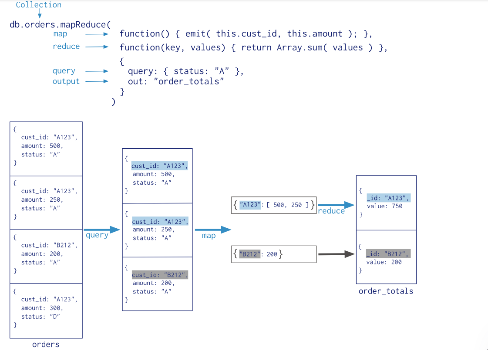

### 


## Suitable usecases
### Event logging
- Document databases can store all these different types of events and can act as a central data   store for event storage.
- Events can be sharded by the name of the application
where the event originated or by the type of event such as `order_processed` or `customer_logged`

### Web Analytics or Real-Time Analytics
New metrics can be easily added without schema changes.

### E-Commerce Applications
E-commerce applications often need to have flexible schema for products and orders, as well as the
ability to evolve their data models without expensive database refactoring or data migration

## When not to use
- **Complex Transactions Spanning Different Operations**: If you need to have atomic cross-document operations, then document databases may not be for you
- **Queries against Varying Aggregate Structure**: Since the data is saved as an aggregate, if the design of the aggregate is constantly changing, you need to normalize the data. In this scenario, document databases may not work.


## Handle schema changes in MongoDB
- Write an upgrade script.
- Incrementally update your documents as they are used.

https://mongodb.github.io/mongo-csharp-driver/2.10/reference/bson/mapping/schema_changes/
https://derickrethans.nl/managing-schema-changes.html

## Strength and weakness
### Strength
- Be able to handle huge amounts of data(and huge amounts of request) by replication and horizontal scaling. 
- Flexible data model, no need to conform a schema
- Easy to use

### Weakness
- Encourage denormalization of schemas, thus lead to `duplicate` data
- Mongo is focused on large datasets, works best in large cluster, which can require some effort to design and manage, setting up a Mongo cluster requires a little more forethought
- Database management is complex
- If indexing is implemented poorly or composite index in an incorrect order, MongoDB can be one of the `slowest database`

## Mongodb index
http://learnmongodbthehardway.com/schema/indexes/
- Indexes are key to achieving high performance in MongoDB
- They allow the database to search through less documents to satisfy a query.
- Without an index MongoDB has to scan through all of the documents in a collection to fulfill the query.
- An index increases the time it takes to insert a document
- Indexes trade off faster queries against storage space.

- MongoDB automatically uses all free memory on the machine as its cache. System resource monitors show that MongoDB uses a lot of memory, but its usage is dynamic. If another process suddenly needs half the server’s RAM, MongoDB will yield cached memory to the other process.[1]

## Database modeling
```
Inp progess ....
```

## MongoBB replicaset
- Group of mongod processes that maintain the same dataset
- Redundancy and high availability
- Increased read capacity
  


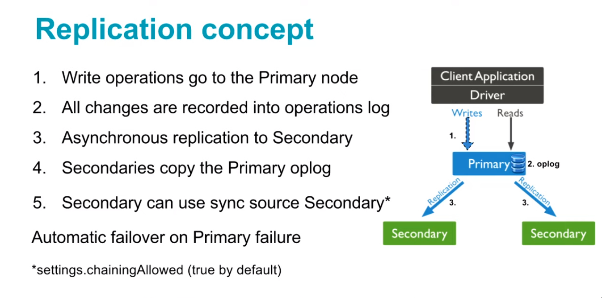

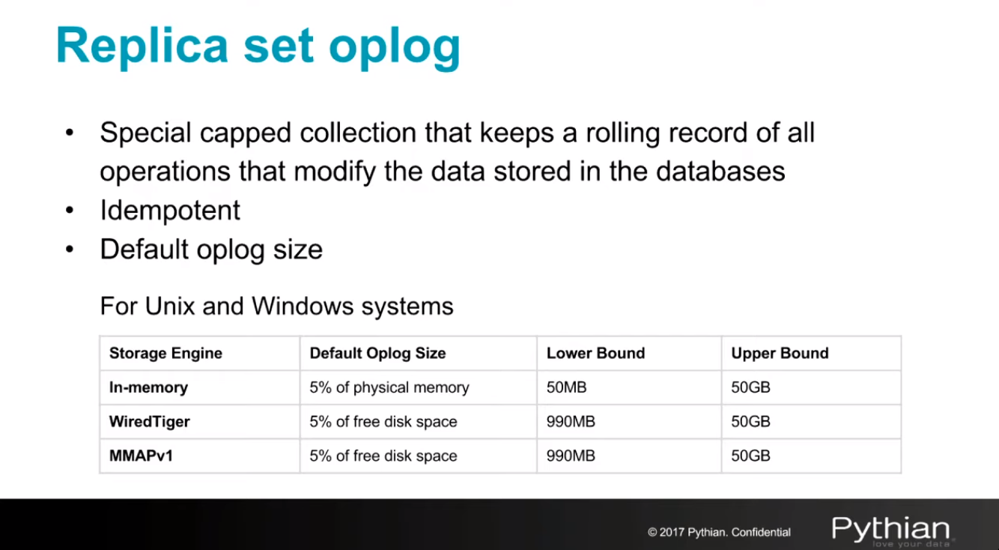

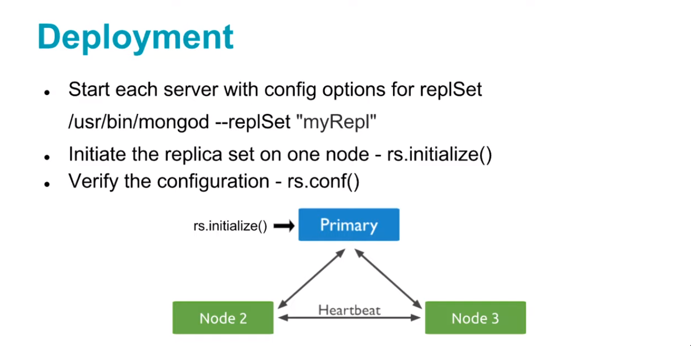

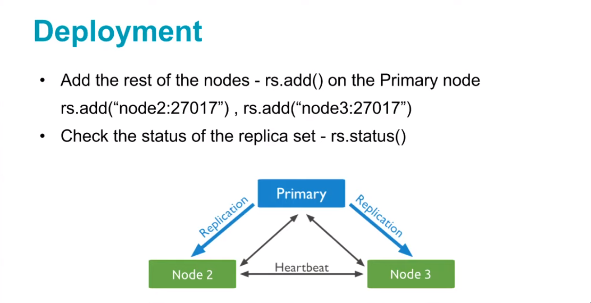

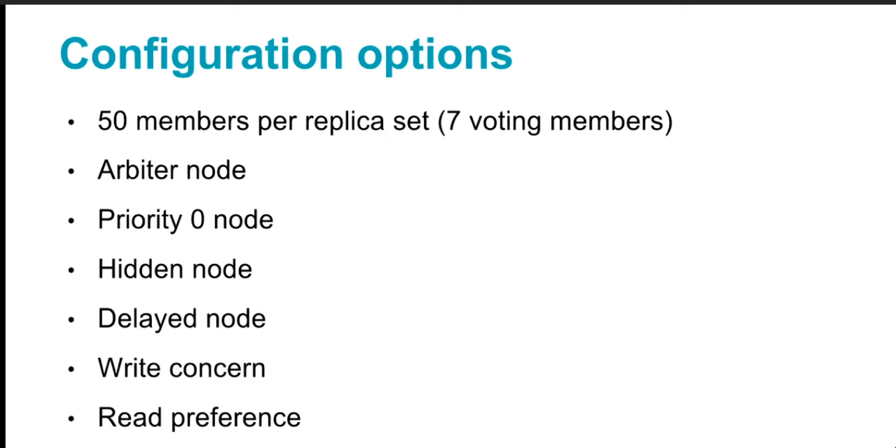

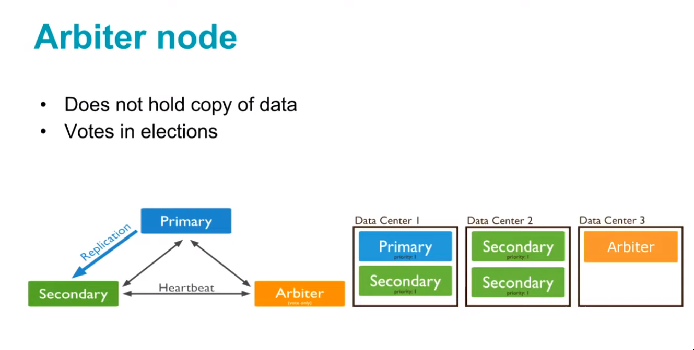

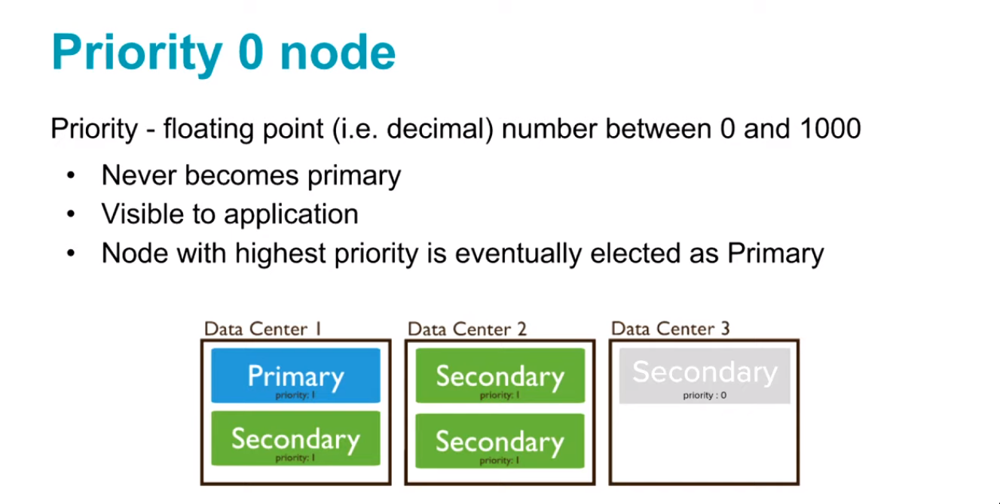

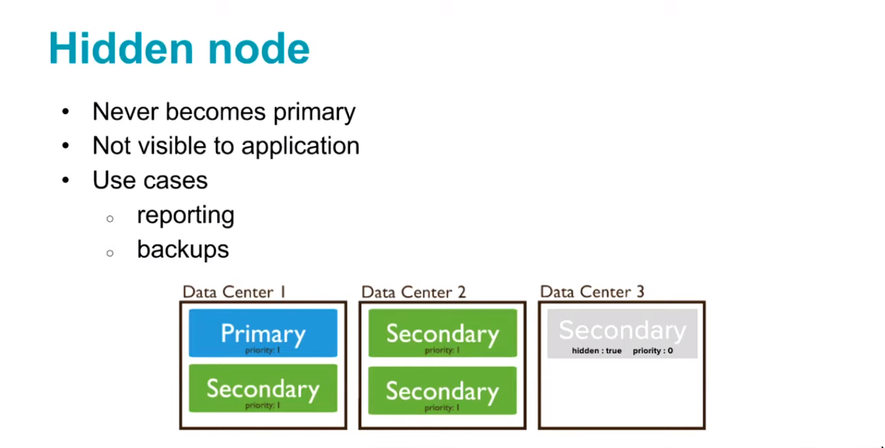

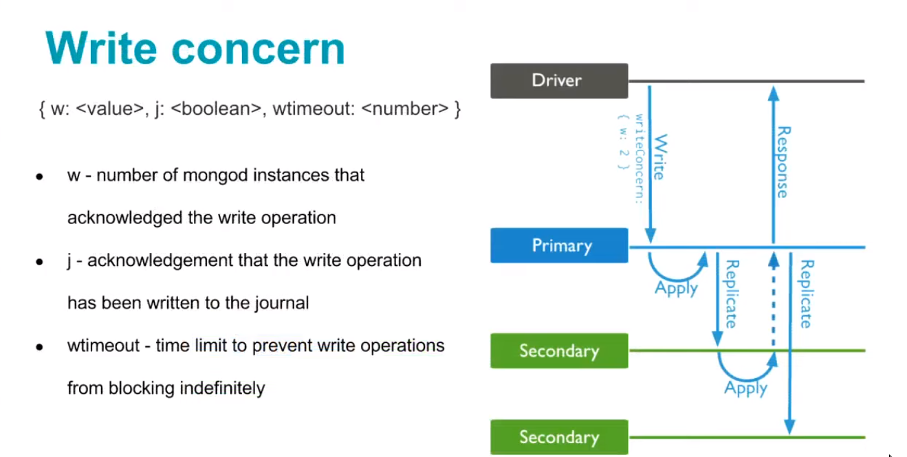
- Manager in application driver 

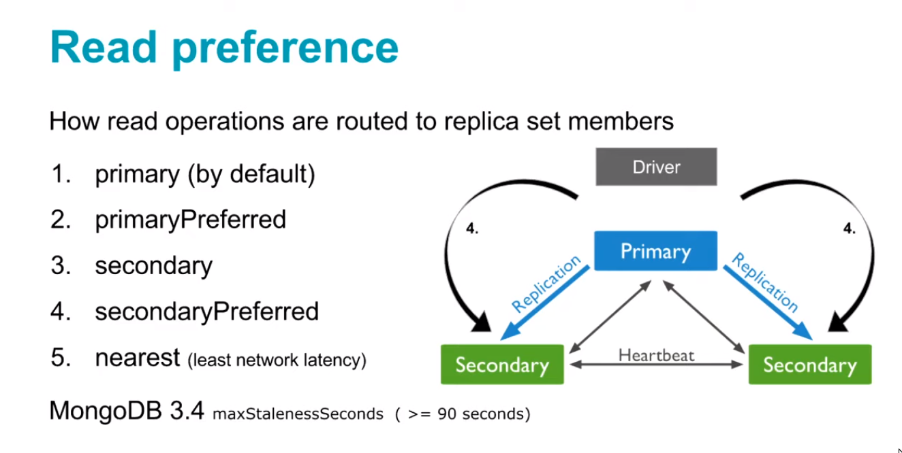

Replica sets allow us high availability, but some point of time, we want

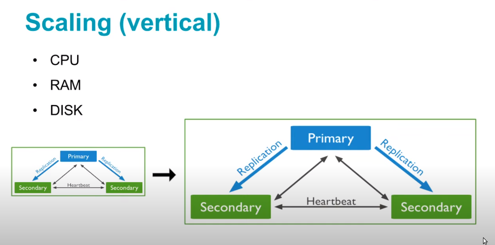

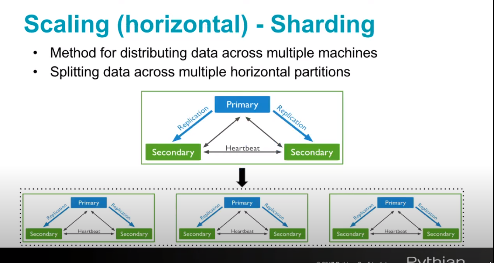

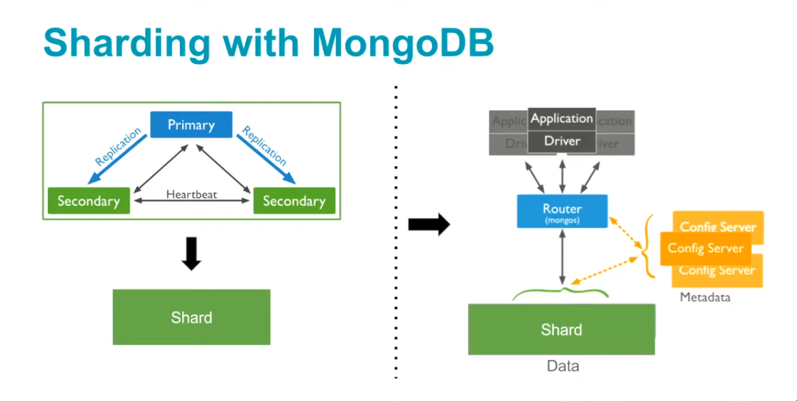

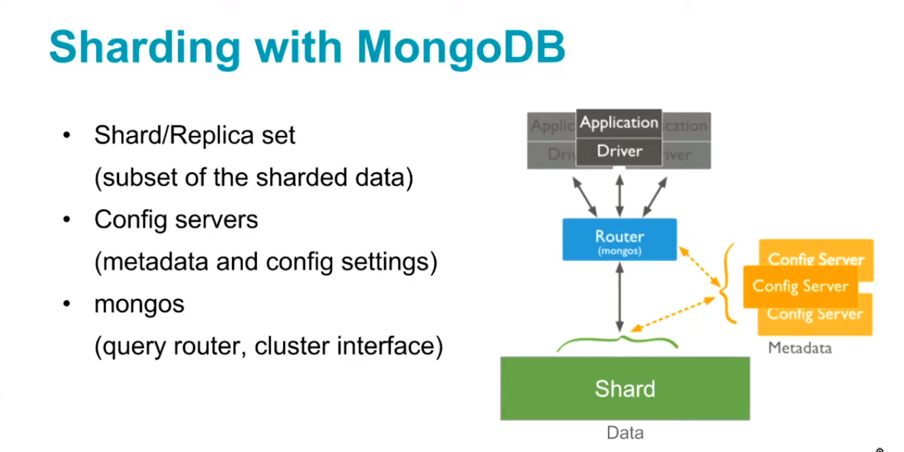


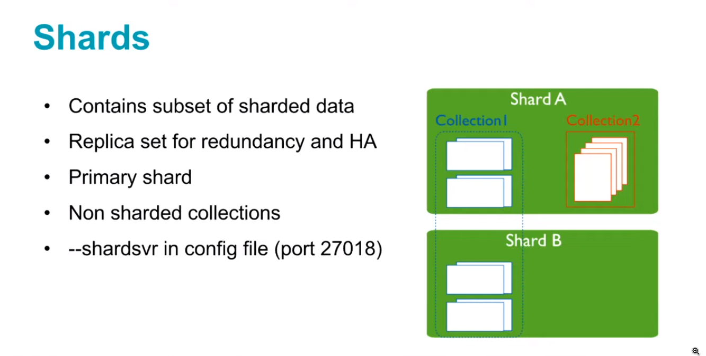

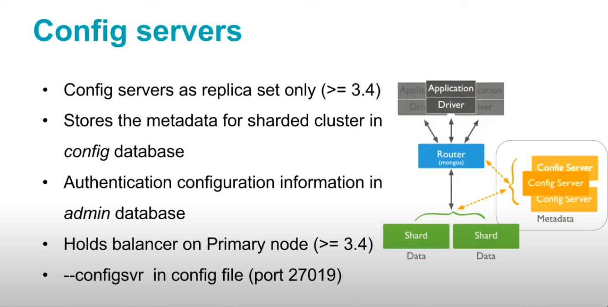

## References
[1]https://stackoverflow.com/a/22010542

[2] https://docs.mongodb.com/manual/core/map-reduce/

