- [Collected resources about database](#collected-resources-about-database)
- [1. Factors to consider when choosing a database system](#1-factors-to-consider-when-choosing-a-database-system)
  - [1.1. Storage engine](#11-storage-engine)
    - [Representatives](#representatives)
    - [Btree vs LSM Benchmark [3]](#btree-vs-lsm-benchmark-3)
    - [Take aways](#take-aways)
  - [1.2. Types of databases](#12-types-of-databases)
    - [1.2.1 Relational database - RDBMS  [4]](#121-relational-database---rdbms-4)
      - [1.2.1.1 ACID](#1211-acid)
    - [1.2.2. NoSQL](#122-nosql)
      - [1.2.2.1. CAP theorem](#1221-cap-theorem)
      - [1.2.2.2. BASE properties of NoSQL](#1222-base-properties-of-nosql)
      - [1.2.2.3. Conceptual techniques of NoSQL [5]](#1223-conceptual-techniques-of-nosql-5)
      - [1.2.2.3. Types of data models](#1223-types-of-data-models)
        - [1. Key-value](#1-key-value)
        - [2. Document-oriented](#2-document-oriented)
        - [3. Column-family](#3-column-family)
        - [4. Graph-Like Data Models [10]](#4-graph-like-data-models-10)
      - [1.2.2.4. Considerations for relational vs. NoSQL systems [4]](#1224-considerations-for-relational-vs-nosql-systems-4)
    - [1.2.3. NewSQL [4]](#123-newsql-4)
  - [1.3. Reliable, Scalable, and Maintainable [4]](#13-reliable-scalable-and-maintainable-4)
    - [Reliability](#reliability)
    - [Scalability](#scalability)
    - [Maintainability](#maintainability)
- [2. Scaling a database system [11]](#2-scaling-a-database-system-11)
  - [2.1. Caching](#21-caching)
    - [2.1.1. Types of database caching](#211-types-of-database-caching)
    - [2.1.2. Caching strategies](#212-caching-strategies)
      - [1. Cache-Aside (Lazy loading)](#1-cache-aside-lazy-loading)
      - [2. Write - through](#2-write---through)
    - [2.1.3. TTL](#213-ttl)
    - [2.1.4. Evictions](#214-evictions)
  - [2.2. Indexing](#22-indexing)
    - [2.2.1. Single index [17]](#221-single-index-17)
    - [2.2.2. Composite index](#222-composite-index)
  - [2.3. Paritioning](#23-paritioning)
  - [3.4. Sharding and replication](#34-sharding-and-replication)
- [3. Caveats for working with a database system](#3-caveats-for-working-with-a-database-system)
    - [3.1. Connection pool](#31-connection-pool)
  - [3.1. RDBMS](#31-rdbms)
    - [3.1.1. Concurrency problems](#311-concurrency-problems)
      - [3.1.1.1. Dirty Read](#3111-dirty-read)
      - [3.1.1.2. Phantom Read](#3112-phantom-read)
      - [3.1.1.3. Lost updates](#3113-lost-updates)
      - [3.1.1.4. Inconsistent Retrievals](#3114-inconsistent-retrievals)
    - [3.1.2. Solving concurrency problems with Locking](#312-solving-concurrency-problems-with-locking)
      - [3.1.2.1. Optimistic lock](#3121-optimistic-lock)
      - [3.1.2.2. Pessmistic lock](#3122-pessmistic-lock)
        - [Exclusive and shared locks](#exclusive-and-shared-locks)
    - [3.1.2. Deadlock](#312-deadlock)
    - [3.1.3. N + 1 query problem](#313-n--1-query-problem)
- [4. Data warehouse](#4-data-warehouse)
- [5. Cloud-native database](#5-cloud-native-database)
- [6. References](#6-references)
  
# Collected resources about database

# 1. Factors to consider when choosing a database system
## 1.1. Storage engine
A database storage engine is an internal software component that a database server uses to store, read, update, and delete data in the underlying memory and storage systems. [1]


|                   | B-Tree based engine                                                                                                                                                                                                                                                                                                                                                                                                                        | Log Structred Merge(LSM) based engine                                                                                                                                                                                      |
| ----------------- | ------------------------------------------------------------------------------------------------------------------------------------------------------------------------------------------------------------------------------------------------------------------------------------------------------------------------------------------------------------------------------------------------------------------------------------------ | -------------------------------------------------------------------------------------------------------------------------------------------------------------------------------------------------------------------------- |
|                   |                                                                                                                                                                                                                                                                                                                                                                         |                                                                                                                                                          |
| **Definition**    | **B-tree** is a self-balancing tree data structure that keeps data sorted and allows searches, sequential access, insertions, and deletions in logarithmic time.                                                                                                                                                                                                                                                                           | **LSM tree** is a data structure with performance characteristics best fit for indexed access to files with high write volume over an extended period.                                                                     |
| **How it works?** | https://www.youtube.com/playlist?list=PLzzVuDSjP25QT0H605qxlcmMy_GBTHi8X                                                                                                                                                                                                                                                                                                                                                                   | <ul><li>https://yetanotherdevblog.com/lsm/</li><li>http://www.benstopford.com/2015/02/14/log-structured-merge-trees/</li></ul>                                                                                             |
|                   |
| **Pros**          | <ul><li>Data and indexes are organized with B-Tree concept and read/writes always has logarithmic time. For 1 million records, it takes 20 comparisions in the B-Tree to locate the required data/pointer in the index [2] </li><li>Each disk access take around 5ms. For 1 million records, it requires 15ms. For 1000 million records, it takes 1,5s.  For 1 billion records, the bill is 15 seconds just to access one row [2]</li><ul> | Fast sequential writes (as opposed to slow random writes in B-tree engines)                                                                                                                                                |
| **Cons**          | <ul><li>The need to maintain a well-ordered data structure with random writes usually leads to poor write performance because random writes to the storage are more expensive than sequential writes</li></ul>                                                                                                                                                                                                                             | <ul><li>Exhibit poor read throughput in comparision to B-tree based engine</li><li>Consume more CPU resources during read operations and take more memory/disk storage(Can be reduced by using **Bloom filter**)</li></ul> |

### Representatives


### Btree vs LSM Benchmark [3]


### Take aways
- If you don't require **extreme write throughput**, `Btree` is likely to be a better choice. `Read throughput is better` and high volumes of writes can be maintained.
- If you have a workload that requires a **high write throughput**, `LSM` is the best choice.

## 1.2. Types of databases

### 1.2.1 Relational database - RDBMS  [4]
The main unit of data organization in a relational database is referred to as a **table**. Each **table** is associated with a schema that defines the names and data types for each table **column**.

Within a table, each data record is represented by a row that is, in turn, identified by a primary key, a tuple of column values that must be unique among all the table rows. Table columns may also reference records that exist in other tables. This type of column is typically referred to as a foreign key.

- Relational databases have been a prevalent technology for decades.
- They're **mature**, **proven**, and **widely implemented**
- They use SQL (Structured Query Language) to manage data, and support **ACID** guarantees.

#### 1.2.1.1 ACID
- **A**tomicity: All operations in a transaction must either succeed or all are rolled back

    - **For Example**: a transaction to transfer funds from one account to another involves making a withdrawal operation from the first account and a deposit operation on the second. If the deposit operation failed, you don’t want the withdrawal operation to happen either.[6]

- **C**onsistency: The database integrity constraints are valid on completion of
the transaction. Which demands that the data must meet all the validation rules. All validation rules must be checked to ensure consistency

    - **For example**: If a field-type in database is Integer, it should accept only Integer value's and not some kind of other.If you want to store other types in this field, consistency are violated. At this condition transaction will rollback.

- **I**solated: 
Simultaneously occurring transactions do not interfere with each other. Contentious concurrent access is moderated by the database
so that transactions appear to run sequentially
    - **For example**:  a teller looking up a balance must be isolated from a concurrent transaction involving a withdrawal from the same account. Only when the withdrawal transaction commits successfully and the teller looks at the balance again will the new balance be reported.[6]

- **D**urable: Irrespective of hardware or software failures, the updates made by the transaction are permanent.
    - **For example**: InnoDB is a transactional storage engine for **MySQL**, which by definition must guarantee durability. It accomplishes this by writing its updates in two places: once to a transaction log and again to an in-memory buffer pool. The transaction log is synced to disk immediately, whereas the buffer pool is only eventually synced by a background thread.[7]

### 1.2.2. NoSQL
- No-SQL databases refer to high-performance, non-relational data stores. 
- Flexible, schemaless data modeling.
- Support large volumes of data by running on clusters. Relational databases are not designed to run effciently on clusters. They excel in their ease-of-use, scalability, resilience, and availability characteristics
- Help dealing with data in **Aggregates**(See 1.2.2.3)

However, as we all know, there is no such thing as a free lunch.
To achieve this performance boost, NoSQL databases have to sacrifice something! Being distributed systems, NoSQL databases must adhere to the rules of the **CAP** theorem.

Additionally, NoSQL databases have to give up **ACID** guarantees to support for scalability. Instead, they employ new properties called **BASE**(1.2.2.2). 


#### 1.2.2.1. CAP theorem
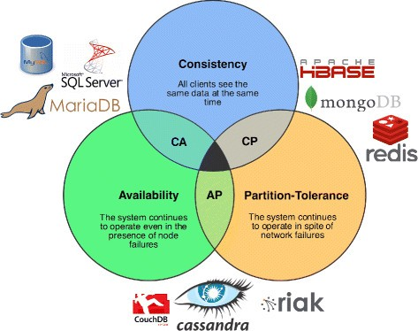

<sup>[Databases categorized in CAP Theorem](https://medium.com/system-design-blog/cap-theorem-1455ce5fc0a0)<sup>

In a distributed computer system, you can only support two of the following guarantees:

- **C**onsistency: Every read receives the most recent write or an error
- **A**vailability: Every request receives a response, without guarantee that it contains the most recent version of the information
- **P**artition Tolerance: The system continues to operate despite arbitrary partitioning due to network failures [8].

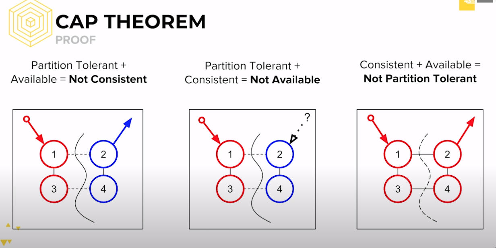

<sup>Image taken from the course [Blockchain at BerkeleyX CS198.2x](https://www.youtube.com/watch?v=K12oQCzjPxE&t=5s)<sup>
  
Networks aren't reliable, so you'll need to support partition tolerance. You'll need to make a software tradeoff between consistency and availability.

**CP**: Consistency and partition tolerance.

Distributed systems in this category typically use a voting protocol to ensure that the majority of nodes agree that they have the most recent version of the stored data; in other words, they reach a [quorum](https://en.wikipedia.org/wiki/Quorum_(distributed_computing)#:~:text=A%20quorum%20is%20the%20minimum,operation%20in%20a%20distributed%20system.). This allows the system to recover from network partitioning events. However, if not enough nodes are available to reach quorum, the system will return an error to clients as data consistency is preferred over availability.[9]

**AP**: Availability and partition tolerance

This class of distributed systems favors availability over consistency. Even in the case of a network partition, an AP system will try to process read requests, although stale data may be returned to the clients.[9]

#### 1.2.2.2. BASE properties of NoSQL
While RDBMS follow the ACID properties, NoSQL databases follow BASE properties.

- **BA**sically available: Guarantees the availability of the data . There will be a response to any request (can be failure too).

- **S**oft state: The state of the system could change over time.

- **E**ventual consistency: The system will eventually become consistent once it stops receiving input.

#### 1.2.2.3. Conceptual techniques of NoSQL [5]
- **1. Denormalization**: Copy the same data into multiple documents in order to optimize or simplify query processing.
  - IO per query vs total data volume: Data can be gouped at one place to have better IO result.
  - Processing complexity vs total data volume: reduce joins.
  
- **2. Aggregates**:
  - Relation
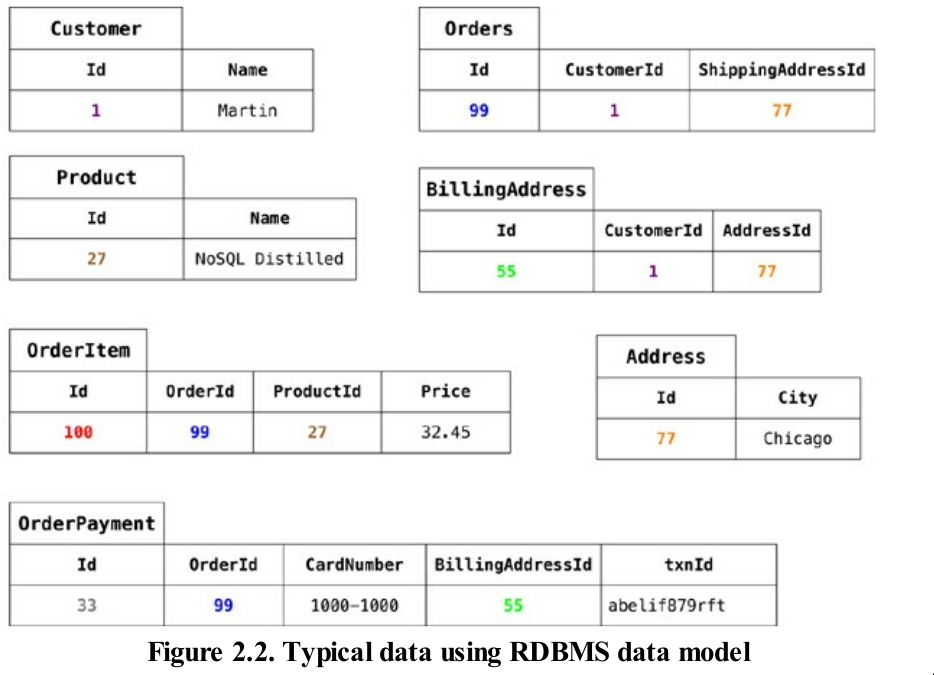

  -  Aggregate
    ```js
    // in customers
    {
        "id":1,
        "name":"Martin",
        "billingAddress":[{"city":"Chicago"}]
    }
    // in orders
    {
        "id":99,
        "customerId":1,
        "orderItems":[
            {
            "productId":27,
            "price": 32.45,
            "productName": "NoSQL Distilled"
            }
        ],
        "shippingAddress":[{"city":"Chicago"}]
        "orderPayment":[
            {
            "ccinfo":"1000-1000-1000-1000",
            "txnId":"abelif879rft",
            "billingAddress": {"city": "Chicago"}
            }
        ],
    }
    ```
  - Dealing in aggregates make it much easier for these databases to handle operating on a cluster, sinces the aggregate makes a natural unit for replication and sharding.
  
  - Aggregates are often easier for application programmers to work with, since they often manipulate data through aggregate structures.
- **3. Application side joins**: Joins are rarely supported in NoSQL solutions. As a consequence of the “question-oriented” NoSQL nature, joins are often handled at design time as opposed to relational models where joins are handled at query execution time.

#### 1.2.2.3. Types of data models 
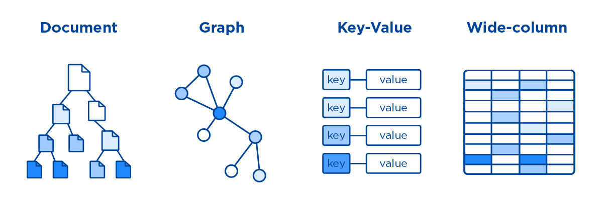
**Key-value** and **Document** databases were strongly aggregate-oriented.

##### 1. Key-value
  - We can access an aggregate in a key value store based on it keys. Redis allows you to break down the aggregate into lists or sets
  - With key-value databases, we expect to mostly look up aggregates using a `key`.
  - The basic set of operations supported by key-value stores are **insertions**, **deletions**, and **lookups**

The data access patterns that are used by key-value stores make data partitioning across multiple nodes much easier compared to other database technologies. This property allows key-value stores to scale horizontally so as to accommodate increased traffic demand.

**Representatives**: Redis, LevelDB, RockDB, Etcd 

##### 2. Document-oriented


  - Flexible data model- Don't need to do a lot of `planning around schemas`.
  - Document databases typically implement their own domain-specific language (DSL) for querying data. 
  - We can access an **aggregate** in a document database by submitting queries
  - They also provide advanced primitives (for example, support for map-reduce) for calculating complex aggregations across multiple documents in a collection.
  - This makes document databases a great fit for generating **business intelligence** (BI) and other types of analytics reports.

**Representatives**: [mongodb.md](mongodb.md), CouchDB, Elasticsearch

##### 3. Column-family
There are many scenarios when you often read a few columns of many rows at once.
- It's better to to store store groups of columns for all rows as the basic storage unit in the disk. 
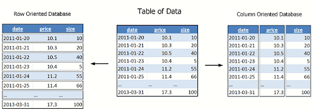

In an RBDMS, the tuples would be stored row-wise, so the data on the disk would be stored as
follows:

`|John,Smith,42|Bill,Cox,23|Jeff,Dean,35|`

In online-transaction-processing (OLTP) applications, the I/O pattern is mostly reading and writing
all of the values for entire records. As a result, row-wise storage is optimal for OLTP databases.

In a columnar database, however, all of the columns are stored together as follows

`|John,Bill,Jeff|Smith,Cox,Dean|42,23,35|`

The advantage here is that if we want to read values such as Firstname, reading one disk block reads a lot more information in the row-oriented case
since each block holds the similar
type of data, is that we can use efficient compression for the block, further reducing disk space and
I/O.

---
**Representatives**: [cassandra.md](cassandra.md), HBase, BigTable

##### 4. Graph-Like Data Models [10]

- If your application has mostly one-to-many relationships (tree-structured data) or no relationships between records, the document model is appropriate.

- If many-to-many relationships are very common in your data? The relational model can handle simple cases of many-to-many relationships, but as the connections within your data become more complex, it becomes more natural to start modeling your data as a graph

A graph consists of two kinds of object: Vertices and edges. Many kinds of data can be modeled as a graph. Typical examples include: 

- Social graphs: Vertices are people, and edges indicate which people know each other.
- The web graph: Vertices are web pages, and edges indicate HTML links to other pages.
Well-known algorithms can operate on these graphs:
- Car navigation system:  search for the shortest path between two points in a road network
- PageRank can be used on the web graph to determine the popularity of a web page
and thus its ranking in search results.

**Representatives**: Neo4j

#### 1.2.2.4. Considerations for relational vs. NoSQL systems [4]
High availability and massive scalability are often more critical to the business than strong consistency. Developers can implement techniques and patterns such as Sagas, CQRS, and asynchronous messaging to embrace eventual consistency.

| Consider a NoSQL datastore when:                                                    | Consider a relational database when:                                  |
| ----------------------------------------------------------------------------------- | --------------------------------------------------------------------- |
| You have high volume workloads that require large scale                             | Your workload volume is consistent and requires medium to large scale |
| Your workloads don't require ACID guarantees                                        | ACID guarantees are required                                          |
| Your data is dynamic and frequently changes                                         | Your data is predictable and highly structured                        |
| Data can be expressed without relationships                                         | Data is best expressed relationally                                   |
| You need fast writes and write safety isn't critical                                | Write safety is a requirement                                         |
| Data retrieval is simple and tends to be flat                                       | You work with complex queries and reports                             |
| Your data requires a wide geographic distribution                                   | Your users are more centralized                                       |
| Your application will be deployed to commodity hardware, such as with public clouds | Your application will be deployed to large, high-end hardware         |

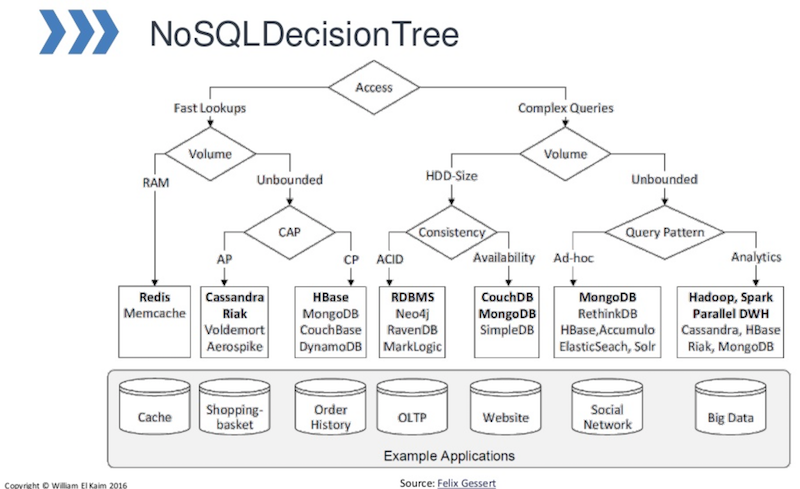

**Sticking with the default**:

There are many cases you’re better off sticking with the default option of a relational database:
- You can easily find people with the experience of using them.
- They are mature, so you are less likely to run into the rough edges of new technology
- Picking a new technology will always introduce a risk of problems should things run into difficulties
### 1.2.3. NewSQL [4]
- NewSQL is an emerging database technology that combines the distributed scalability of NoSQL with the ACID guarantees of a relational database.
- NewSQL databases are important for business systems that must process high-volumes of data, across distributed environments, with full transactional support and ACID compliance.
- A key design goal for NewSQL databases is to work natively in **Kubernetes**, taking advantage of the platform's resiliency and scalability.

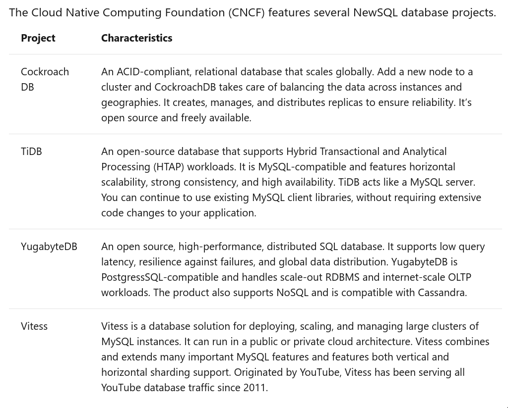

## 1.3. Reliable, Scalable, and Maintainable [4]
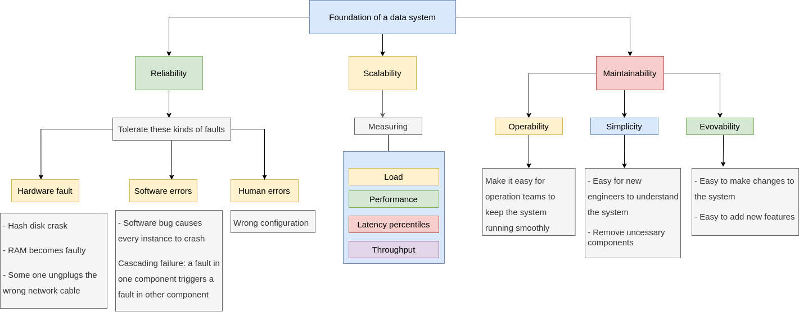

Three concerns that are important in most database systems:

### Reliability
- `Tolerate` hardware and software & software faults
- The system should continue to work correctly even in the face of adversity.

### Scalability   
- Measuring  load & performance
- Latency percentiles, throughput
- As the system grows, there should be reasonable ways of dealing with that growth. Scalability is the term we use to describe a system’s ability to cope with increased
load.

### Maintainability
- **Operability**: Make it easy for operations teams to keep the system running smoothly.
- **Simplicty**: Make it easy for new engineers to understand the system, by removing as much complexity as possible from the system.
- **Evolvability**: Make it easy for engineers to make changes to the system in the future, adapting
it for unanticipated use cases as requirements change. Also known as extensibility, modifiability, or plasticity.

> See more details: [database-foundation.md](database-foundation.md)

# 2. Scaling a database system [11]
## 2.1. Caching 
When you’re building distributed applications that require low latency and
scalability, disk-based databases can pose a number of challenges.
- Slow processing queries
- Cost to scale
  
A database cache supplements your primary database by removing unnecessary pressure on it

### 2.1.1. Types of database caching
Types of database caching:
- **Local caches**:
  - A local cache stores your frequently used data within your application.
  - This makes data retrieval faster than other caching architectures because it removes network traffic that is associated with retrieving data. 
  - **A major disadvantage** is that among your applications, each node has
its own resident cache working in a disconnected manner.
- **Remote caches**:
  - A remote cache (or “side cache”) is a separate instance (or instances) dedicated for storing the cached data in-memory.
  - Remote caches are stored on dedicated servers and are typically built
on key/value NoSQL stores, such as Redis and Memcached.

### 2.1.2. Caching strategies
#### 1. Cache-Aside (Lazy loading)
- When you application needs to read data from database, it checks the cache first to determine whether the data is available
- If the data is available, the cached is returned, and the response is issued to the caller
- If the data isn't available. Query from database. The cache is then populated with the data that is retrived from the database, and the data is returned to the caller
  
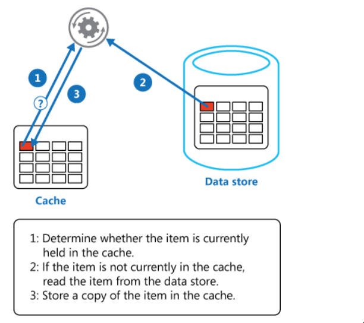

Advantages:
  - The cache contains only data that the application requests, which helps keep the cache size cost effective
  - Implementation is easy, straightforward

Disadvanges:
  - The data is loaded into the cache only after a cache miss, some overhead is added to the initial response time because additional roundtrips to the cache and database are needed

#### 2. Write - through
- application batch or backend process updates the primary database
- Immediately afterward, the data is also updated in the cache

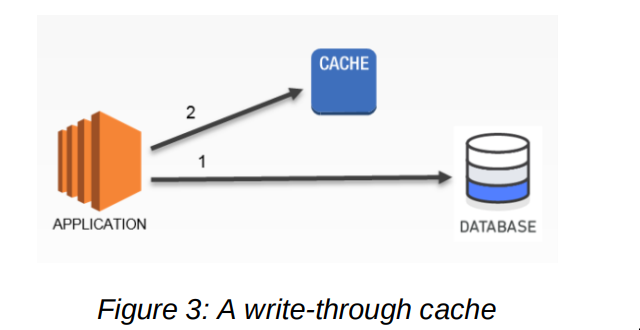


Advantages:
  - Because cache is up-to-date with primary database. There is a much greater likelihood that the data will be found in the cache. This in turn results in better overall application performance and user experience
  - The performance of your database is optimal because fewer database reads are performed

Disadvantages:
  - Infrequent requested data is also writen to the cache, resulting in a larger and more expensive cache

A proper caching strategy includes effective use of both write-through and lazy-loading of your data and setting an approriate expiration for the data to keep it relevant and lean

### 2.1.3. TTL
- When apply TTLs to your cache keys. you should add some time jitter to your TTL. This reduces the possiblity of heavy load occurring when your cached data expires  Take, for example, the scenario of
caching product information. If all your product data expires at the same time
and your application is under heavy load, then your backend database has to
fulfill all the product request that could generate too
much pressure on your database, resulting in poor performance. By adding
slight jitter to your TTLs, a randomly generated time value (e.g., TTL = your
initial TTL value in seconds + jitter) 

### 2.1.4. Evictions 
- Evictions occur when cache memory is overfilled or is greater than the
maxmemory setting for the cache, causing the engine selecting keys to evict in
order to manage its memory.
- The keys that are chosen are based on the
eviction policy you select

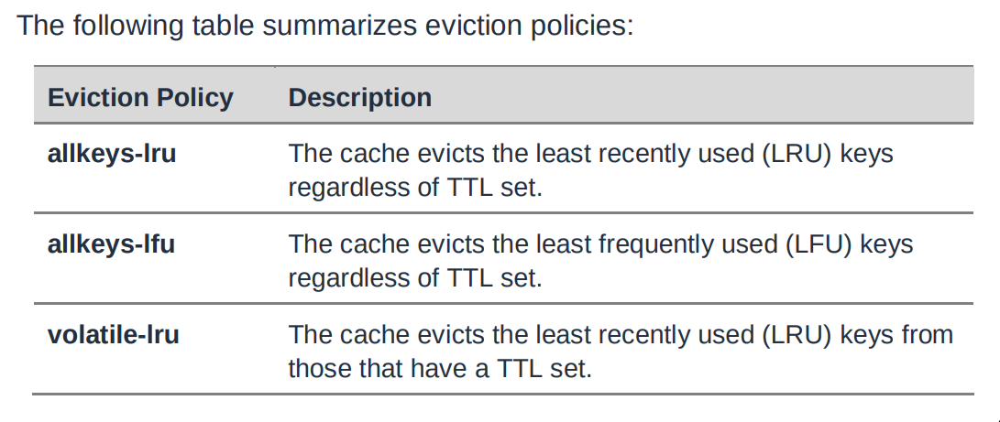


## 2.2. Indexing 
Querying a database table of n records by a field other than a <i>**key**</i>, requires O(n) record reads.

- A database index is a data structure(typically **B-tree**) that improves the speed of data retrieval operations on a database table at the cost of additional writes and storage space to maintain the index data structure.
- Indexes are used to quickly locate data without having to search every row in a database table every time a database table is accessed.
- Indexes can be created using one or more columns of a database table, providing the basis for both rapid random lookups and efficient access of ordered records.
### 2.2.1. Single index [17]
- A single-column index is an index based on the values in one column of a table.
- An index on a column is an additional data structure of the table’s records sorted (typically via b-tree) only on that column.
- Each record in the index also includes a pointer to the original record in the table, such that finding records in the index is equivalent to finding records in the original table.

For example: We have a data sample

| ID  | first_name | last_name    | Class      | Position | ssn  |
| --- | ---------- | ------------ | ---------- | -------- | ---- |
| 1   | Teemo      | Shroomer     | Specialist | Top      | 2345 |
| 2   | Cecil      | Heimerdinger | Specialist | Mid      | 5461 |
| 3   | Annie      | Hastur       | Mage       | Mid      | 8784 |
| 4   | Fiora      | Laurent      | Slayer     | Top      | 7867 |
| 5   | Garen      | Crownguard   | Fighter    | Top      | 4579 |
| 6   | Malcolm    | Graves       | Specialist | ADC      | 4578 |
| 7   | Irelia     | Lito         | Figher     | Top      | 5689 |
| 8   | Janna      | Windforce    | Controller | Support  | 4580 |
| 9   | Jarvan     | Lightshield  | Figher     | Top      | 4579 |
| 10  | Katarina   | DuCouteau    | Assassin   | Mid      | 5608 |

If we create an index on users.first_name
`CREATE INDEX first_name_index ON users (first_name) USING BTREE;`
It would create a sorting of the users by their first_name with a pointer to their primary key, something like this:
```
Annie    -> 3
Cecil    -> 2
Emilia   -> 12
Fiora    -> 4
Garen    -> 5
Irelia   -> 7
Janna    -> 8
Jarvan   -> 9
Jericho  -> 19
Katarina -> 10
Kayle    -> 11
```
Then a query like
```sql
SELECT * FROM users WHERE first_name = 'Teemo'; 
``` 
would take only O(log_2(n)) reads since the database can perform a binary search on this index, since it is sorted by first_name .

### 2.2.2. Composite index
A composite index is an index based on the values in multiple columns of a table.
Back to our example:
| ID  | first_name | last_name    | Class      | Position | ssn  |
| --- | ---------- | ------------ | ---------- | -------- | ---- |
| 1   | Teemo      | Shroomer     | Specialist | Top      | 2345 |
| 2   | Cecil      | Heimerdinger | Specialist | Mid      | 5461 |
| 3   | Annie      | Hastur       | Mage       | Mid      | 8784 |
| 4   | Fiora      | Laurent      | Slayer     | Top      | 7867 |
| 5   | Garen      | Crownguard   | Fighter    | Top      | 4579 |
| 6   | Malcolm    | Graves       | Specialist | ADC      | 4578 |
| 7   | Irelia     | Lito         | Figher     | Top      | 5689 |
| 8   | Janna      | Windforce    | Controller | Support  | 4580 |
| 9   | Jarvan     | Lightshield  | Figher     | Top      | 4579 |
| 10  | Katarina   | DuCouteau    | Assassin   | Mid      | 5608 |

```sql
CREATE INDEX class_pos_index ON users (class, position);
```
Then we will have a B-tree like this
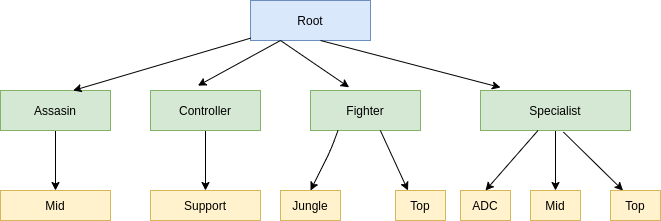
To execute a query with composite index.
We **must** provide index keys **in order**.
```
SELECT * FROM users  WHERE class = 'Specialist' AND position = 'Top';
```

Howevery a query like
```
SELECT * FROM users WHERE position = 'Top';
```
will NOT benefit from this composite index because position is the second field. 

---
**Avoid Unnecessary Indexes**: adding unnecessary indexes can actually degrade performance overall.
* Additional storage space to store indexes
* Indexes also need to be updated when state-changing queries like CREATE UPDATE and DELETE are made 

**Guidelines for when to use index**: 
* Do not use an index for low-read but high-write tables. As mentioned previously
* Do not use an index if the field has `low cardinality`, the number of distinct values in that field. 
* Do not use an index for small fixed-size tables. 

## 2.3. Paritioning
Partitioning is the database process where very large tables are divided into multiple smaller parts. By splitting a large table into smaller, individual tables, queries that access only a fraction of the data can run faster because there is less data to scan. 
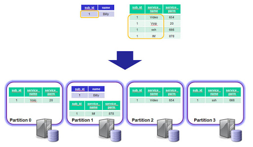

Types of partitioning:
- **RANGE partitioning**:  This type of partitioning assigns rows to partitions based on column values falling within a given range. [18]
```sql
CREATE TABLE members (
    firstname VARCHAR(25) NOT NULL,
    lastname VARCHAR(25) NOT NULL,
    username VARCHAR(16) NOT NULL,
    email VARCHAR(35),
    joined DATE NOT NULL
)
PARTITION BY RANGE( YEAR(joined) ) (
    PARTITION p0 VALUES LESS THAN (1960),
    PARTITION p1 VALUES LESS THAN (1970),
    PARTITION p2 VALUES LESS THAN (1980),
    PARTITION p3 VALUES LESS THAN (1990),
    PARTITION p4 VALUES LESS THAN MAXVALUE
);
```
- **HASH partitioning**: With this type of partitioning, a partition is selected based on the value returned by a user-defined expression that operates on column values in rows to be inserted into the table.
```sql
CREATE TABLE employees (
    id INT NOT NULL,
    fname VARCHAR(30),
    lname VARCHAR(30),
    hired DATE NOT NULL DEFAULT '1970-01-01',
    separated DATE NOT NULL DEFAULT '9999-12-31',
    job_code INT,
    store_id INT
)
PARTITION BY HASH(store_id)
PARTITIONS 4;
```
- **LIST partitioning**:  Similar to partitioning by RANGE, except that the partition is selected based on columns matching one of a set of discrete values.
```sql
CREATE TABLE employees (
    id INT NOT NULL,
    fname VARCHAR(30),
    lname VARCHAR(30),
    hired DATE NOT NULL DEFAULT '1970-01-01',
    separated DATE NOT NULL DEFAULT '9999-12-31',
    job_code INT,
    store_id INT
)
PARTITION BY LIST(store_id) (
    PARTITION pNorth VALUES IN (3,5,6,9,17),
    PARTITION pEast VALUES IN (1,2,10,11,19,20),
    PARTITION pWest VALUES IN (4,12,13,14,18),
    PARTITION pCentral VALUES IN (7,8,15,16)
);
```
- **KEY partitioning**: This type of partitioning is similar to partitioning by HASH, except that only one or more columns to be evaluated are supplied, and the databaes server provides its own hashing function.
```sql
CREATE TABLE members (
    firstname VARCHAR(25) NOT NULL,
    lastname VARCHAR(25) NOT NULL,
    username VARCHAR(16) NOT NULL,
    email VARCHAR(35),
    joined DATE NOT NULL
)
PARTITION BY KEY(joined)
PARTITIONS 6;
```
   
## 3.4. Sharding and replication

# 3. Caveats for working with a database system
### 3.1. Connection pool
- Is a cache of database connection maintained so that the connections can be reused when future requests to the database are required. 
- Connection pool are used to enhance the performance of executing commands on a database, thus reduce the overhead of establishing, closing the connection everytime.
  
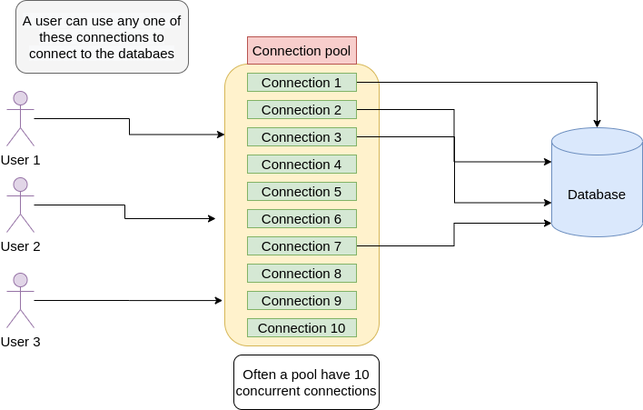
Parameters when configure a connection pool
- `maxConnection`: how many connections do you want by default, default is 10. The maximum number of connections you want to create
  - User ask the pool, query this for me, pick one of those 20 connections
  - If there are no connection left, all of them are busy or used, you have to wait as a client, and there is a time out for that.

- `connectionTimeoutMillisec`: how long should the pool give me a new connection if every one is busy
- `idletimeoutMillisec`: If those connection are not used, when do you want me to get rid of it?

## 3.1. RDBMS
### 3.1.1. Concurrency problems
When multiple transactions execute concurrently in an uncontrolled or unrestricted manner, then it might lead to several problems. These problems are commonly referred to as concurrency problems in database environment.

#### 3.1.1.1. Dirty Read
The dirty read occurs in the case when one transaction updates an item of the database, and then the transaction fails for some reason. The updated database item is accessed by another transaction before it is changed back to the original value. [14]

For example:
A transaction T1 updates a record which is read by T2. If T1 aborts then T2 now has values which have never formed part of the stable database.

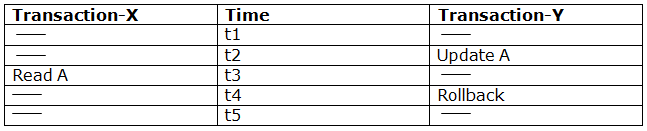
- At time t2, transaction-Y writes A's value.
- At time t3, Transaction-X reads A's value.
- At time t4, Transactions-Y rollbacks. So, it changes A's value back to that of prior to t1.
- So, Transaction-X now contains a value which has never become part of the stable databas

#### 3.1.1.2. Phantom Read
The so-called phantom problem occurs within a transaction when the same query produces different sets of rows at different times. For example, if a SELECT is executed twice, but returns a row the second time that was not returned the first time, the row is a “phantom” row.


<sup>Phantom read process [source](https://vladmihalcea.com/non-repeatable-read/)</sup>

For example: Alice and Bob start two database transactions.
1. Bob’s reads all the post_comment records associated with the post row with the identifier value of 1.
2. Alice adds a new post_comment record which is associated with the post row having the identifier value of 1.
Alice commits her database transaction.
3. If Bob’s re-reads the post_comment records having the post_id column value equal to 1, he will observe a different version of this result set.

#### 3.1.1.3. Lost updates
A lost update occurs when two different transactions are trying to update the same column on the same row within a database at the same time. 


<sup>The process involved in a lost update. [Source: Vlad Mihalcea's blog. ](https://medium.com/system-design-blog/cap-theorem-1455ce5fc0a0)<sup>
#### 3.1.1.4. Inconsistent Retrievals
Inconsistent Retrievals Problem is also known as unrepeatable read. When a transaction calculates some summary function over a set of data while the other transactions are updating the data, then the Inconsistent Retrievals Problem occurs. [14]

For example: Suppose two transactions operate on three accounts.
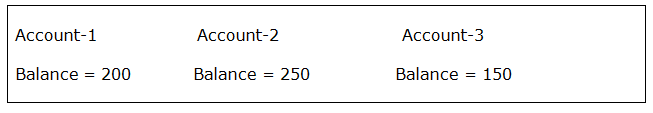

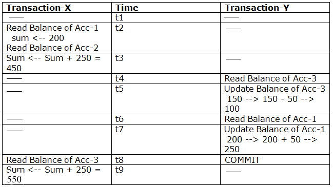

In this example,
- Transaction-X is doing the sum of all balance while transaction-Y is transferring an amount 50 from Account-1 to Account-3.
- Here, transaction-X produces the result of 550 which is incorrect. If we write this produced result in the database, the database will become an inconsistent state because the actual sum is 600.
Here, transaction-X has seen an inconsistent state of the database.

### 3.1.2. Solving concurrency problems with Locking
We can solve concurrency problems above in a RDBMS with locking mechanisms.

#### 3.1.2.1. Optimistic lock
Always think that there is no concurrency problem, every time you go to fetch data, always think that there will be no other threads to modify the data, so it will not be locked, but in the update will be judged that other threads before the data is modified, generally using the version number mechanism.

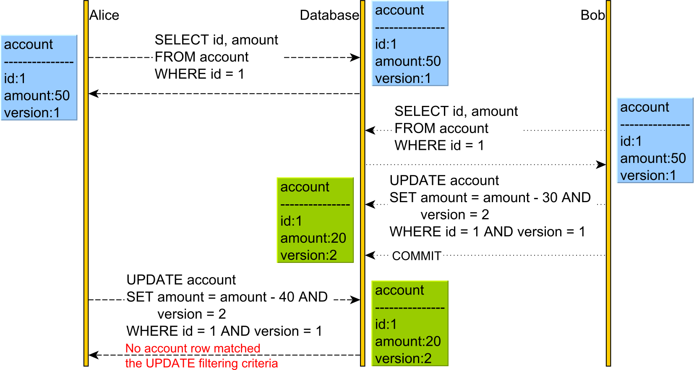

we have an additional version column. The version column is incremented every time an UPDATE or DELETE is executed, and it is also used in the WHERE clause of the UPDATE and DELETE statements. For this to work, we need to issue the SELECT and read the current version prior to executing the UPDATE or DELETE, as otherwise, we would not know what version value to pass to the WHERE clause or to increment.[12]

#### 3.1.2.2. Pessmistic lock
Pessimistic locks are divided into two types: exclusive and shared locks

##### Exclusive and shared locks
- **Exclusive lock**: When a transaction acquire an exclusive lock, no others transaction can read or 
write

For example: We are implementing a ticket booking system for a cinema
```
CREATE TABLE seats(
  id INT PRIMARY KEY,
  is_booked BOOLEAN,
  customer_id INT,
)
```


```js
query = "SELECT * FROM seats WHERE id = 15 and is_booked = false"
result = sqlConn.query(query)
if (result) {
  return "seats is already booked"
}

updateQuery = "UPDATE seats set isBooked = true and customer_id = $customer_id"
sqlConn.Execute(updateQuery)
```

These lines of code seem to work fine. However this piece of code has a vulnerability and will break when there are two customers concurrently trying to book the same seat and will cause inconsistent behaviours.

| Customer id = 1                                                    | Customer id = 2                                                    |
| ------------------------------------------------------------------ | ------------------------------------------------------------------ |
| SELECT * FROM seats WHERE id = 15 and is_booked = false            | SELECT * FROM seats WHERE id = 15 and is_booked = false            |
| result = seat(id 15, is_booked = false, customer_id = null )       | result = seat(id 15, is_booked = false, customer_id = null )       |
| update seat set is_booked = true and customer _id = 1 where id =15 |                                                                    |
| ... a moment later                                                 | ....                                                               |
|                                                                    | update seat set is_booked = true and customer _id = 2 where id =15 |


Final results: `seat{id: 15, is_booked: true, customer_id: 2}`.
Although the customer `1` book the seat first, the seat finally belongs to the customer `2`. We can notice that this is a `Lost update` concurrency problem. 

How to solve this? We need to acquire an exclusive lock on a row when we're reading it.
```js
query = "SELECT * FROM seats WHERE id = 15 and is_booked = false FOR UPDATE"
result = sqlConn.query(query)
```

With `FOR UPDATE` statement, we acquired a lock on the row, the lock will be released when the update statement is executed.


- Shared lock: Everycan can read but can not write.
```sql
SELECT * FROM table_name WHERE ... LOCK in SHARE MODE;
```
---
Which one to pick `optimistic` vs `pessmimistic`?

It depends. You should pick your locking scheme based on your application requirements.
- **Optimistic locking** is useful if the possibility for conflicts is very low – there are many records but relatively few users, or very few updates and mostly read-type operations.

- **Pessimistic locking** is useful if there are a lot of updates and relatively high chances of users trying to update data at the same time.

For example, in the case of social games
1. Character and player inventory information is heavily accessed during gameplay, requiring fast read-write access. We should use **Pessimistic locking** for this scenario.

2. Player accounts and preferences are read during player login or at the start of a game
but not frequently updated. **Optimistic locking** would work well here too.[13]
### 3.1.2. Deadlock

In a database, a deadlock is a situation that occurs when two or more different database sessions have some data locked, and each database session requests a lock on the data that another, different, session has already locked. Because the sessions are waiting for each other, nothing can get done, and the sessions just waste time instead. This scenario where nothing happens because of sessions waiting indefinitely for each other is known as deadlock.

For example: [16]
```sql
--Two global temp tables with sample data for demo purposes.
CREATE TABLE ##Employees (
    EmpId INT IDENTITY,
    EmpName VARCHAR(16),
    Phone VARCHAR(16)
)

INSERT INTO ##Employees (EmpName, Phone)
VALUES ('Martha', '800-555-1212'), ('Jimmy', '619-555-8080')

CREATE TABLE ##Suppliers(
    SupplierId INT IDENTITY,
    SupplierName VARCHAR(64),
    Fax VARCHAR(16)
)

INSERT INTO ##Suppliers (SupplierName, Fax)
VALUES ('Acme', '877-555-6060'), ('Rockwell', '800-257-1234')
```

```
Session 1                   | Session 2
===========================================================
BEGIN TRAN;                 | BEGIN TRAN;
===========================================================
UPDATE ##Employees
SET EmpName = 'Mary'
WHERE EmpId = 1
===========================================================
                             | UPDATE ##Suppliers
                             | SET Fax = N'555-1212'
                             | WHERE SupplierId = 1
===========================================================
UPDATE ##Suppliers
SET Fax = N'555-1212'
WHERE SupplierId = 1
===========================================================
<blocked>                    | UPDATE ##Employees
                             | SET Phone = N'555-9999'
                             | WHERE EmpId = 1
===========================================================
                             | <blocked> 
                             | <deadlock error throw>
===========================================================
```
```
Transaction was deadlocked on lock resources with another process and has been chosen as the deadlock victim. Rerun the transaction.
```
### 3.1.3. N + 1 query problem
The n+1 query is defined as a query that fetches n records from the database, then runs an addition query for each of those records.

```sql
SELECT * FROM users WHERE account_id = 42;
```
returns users 3,5,27,38,99
- Now select the expenses for each user
```
SELECT * FROM expenses WHERE user_id = 3;
SELECT * FROM expenses WHERE user_id = 5;
SELECT * FROM expenses WHERE user_id = 27;
SELECT * FROM expenses WHERE user_id = 38;
SELECT * FROM expenses WHERE user_id = 99;
```
**Prefetching** (aka eager-loading) means if we expect the application to also query for the expenses, then we batch query them by user_id , resulting in just 2 queries instead of 5.
```
SELECT * FROM users WHERE account_id = 42;
SELECT * FROM expenses WHERE user_id IN (3,5,27,38,99);
```
Many ORM frameworks already support prefetching such as `Include` method, so just be sure to use them.
# 4. Data warehouse

# 5. Cloud-native database

# 6. References
[1] https://blog.yugabyte.com/a-busy-developers-guide-to-database-storage-engines-the-basics/

[2] https://medium.com/@ckayay/how-to-pick-the-right-database-c2539efe2589 

[3] https://github.com/wiredtiger/wiredtiger/wiki/Btree-vs-LSM

[4] https://docs.microsoft.com/en-us/dotnet/architecture/cloud-native/relational-vs-nosql-data

[5] https://highlyscalable.wordpress.com/2012/03/01/nosql-data-modeling-techniques/

[6] ACID https://stackoverflow.com/a/999447

[7] https://www.amazon.com/MongoDB-Action-Kyle-Banker/dp/1935182870

[8] https://github.com/donnemartin/system-design-primer#eventual-consistency

[9] https://www.amazon.com/Hands-Software-Engineering-Golang-programming/dp/1838554491

[10] https://www.amazon.com/Designing-Data-Intensive-Applications-Reliable-Maintainable/dp/1449373321

[11] https://d0.awsstatic.com/whitepapers/Database/database-caching-strategies-using-redis.pdf

[12 optimistic-vs-pessimistic-locking] https://stackoverflow.com/a/58952004

[13] https://blog.couchbase.com/optimistic-or-pessimistic-locking-which-one-should-you-pick/

[14] https://www.javatpoint.com/dbms-concurrency-control#:~:text=Inconsistent%20Retrievals%20Problem%20is%20also,the%20Inconsistent%20Retrievals%20Problem%20occurs.

[15] https://secure.phabricator.com/book/phabcontrib/article/n_plus_one/

[16] Deadlock - https://stackoverflow.com/a/22825825

[17] https://medium.com/@User3141592/single-vs-composite-indexes-in-relational-databases-58d0eb045cbe#:~:text=Like%20a%20single%20index%2C%20a,a%20concatenation%20of%20multiple%20fields.&text=will%20NOT%20benefit%20from%20this,position%20is%20the%20second%20field.

[18] https://dev.mysql.com/doc/mysql-partitioning-excerpt/5.7/en/partitioning-overview.html